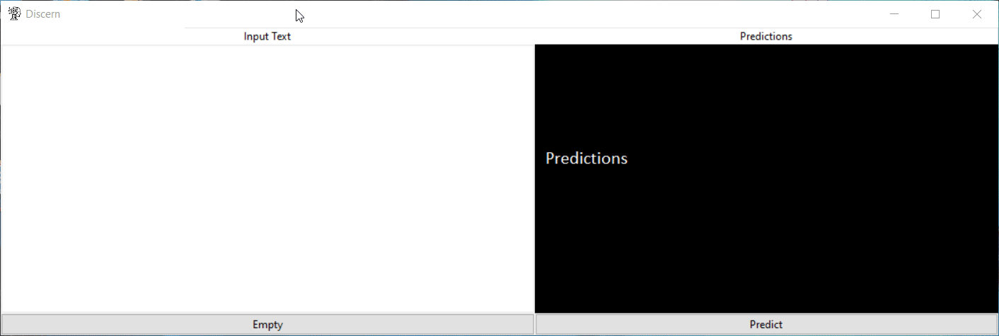

# Discern

**Version 1.0**

Discern is an offline Handwritten Character Recognizer built using Python. It uses a Convolutional Neural Network to recognize the characters (both numbers and alphabets). This is how it works.

Dataset: [EMNIST](https://www.nist.gov/node/1298471/emnist-dataset).

---
## Contributors

-Ajay Athitya <ajayathitya@gmail.com>

---
## License & Copyright

© Ajay Athitya

Licensed under the [MIT License](LICENSE) .
